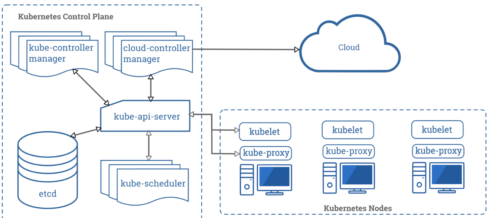

# Cluster Architecture

## Nodes
A node is a worker machine. Formerly known as a _minion_. May be a physical machine or a VM. Each node contains all services necessary to run pods. Services include:

* container runtime
* kubelet
* kube-proxy

### Node Status
Status contains:
* Addresses
* Conditions
* Capacity
* Info

```bash
$ kubectl describe node <node name>
```
#### Addresses
* HostName
* ExternalIP
* InternalIP

#### Conditions
* Ready
* MemoryPressure
* PIDPressure
* DiskPressure
* NetworkUnavailable

```json
"conditions": [
  {
    "type": "Ready",
    "status": "True",
    "reason": "KubeletReady",
    "message": "kubelet is posting ready status",
    "lastHeartbeatTime": "2019-06-05T18:38:35Z",
    "lastTransitionTime": "2019-06-05T11:41:27Z"
  }
]
```
If status of Ready condition remains unknown or False longer than the pod-eviction-timeout (by default, 5 minutes), the node's pods are scheduled for deletion.
* capacity block
* allocable block

#### Info
General info about the node (kernel version, Kubernetes version, Docker version, and OS name).

#### Capacity
Resources available to the node: CPU, RAM, and number of pods that can be scheduled to run there.

### Management
Nodes are not created by Kubernetes directly, instead they're created by the underlying cloud provider (e.g. Google Compute Engine or Amazon EC2).

After creation, K checks validity. If it is valid, it can run a pod. Otherwise it is ignored.

#### Node Controller
A K master component that manages nodes.

_Heartbeats_ are send by K nodes to determine their availability.
* NodeStatus (updated by kubelet)
* Lease Object (in the kube-node-lease namespace)

_Realiability_ depends on pod eviction decisions.

Rate of eviction usually follows the ```--node-eviction-rate``` (def 0.1).

But the behavior changes if the availability zone is unhealthy:

* Rate is reduced if the fraction is at ```--unhealthy-zone-threshold``` threshold (def 0.55) or better.
* Is stopped If cluster small (less than or equal to ```--large-cluster-size-threshold`` (def 50), otherwise uses ```--secondary-node-eviction-rate``` (def 0.01).

Starting in K 1.6, NodeController will also evict pods on nodes running with NoExecute taints. A feature in alpha also adds taints for problems like node unreachable or not ready. In 1.8 alpha, controller can also create taints for node conditions.

#### Self-Registration of Nodes
If kublet flag ```--register-node``` is true, the kubelet will attempt to register with the API server. The kubelet would be started with:

```
--kubeconfig <path>
--cloud-provider
--register-node
--register-with-taints <list of taints>
--node-ip <ip address of node>
--node-labels <labels to add>
--node-status-update-frequency <integer>
```

_Manual Node Administration_ (by creating and modifying node objects) can be done by the cluster admin.

To go manual, use kublet flag ```--register-node=false```.

To mark a node as unscheduable (in preparation for reboot):

```
$ kubectl cordon <node name>
```

#### Node Capacity
If doing manual admin, need to set node capacity when adding.

To reserve resources for non-Pod processes, see [reserve resources for system daemons](https://kubernetes.io/docs/tasks/administer-cluster/reserve-compute-resources/#system-reserved).

### Node topology
In 1.8 alpha, if ```TopologyManager``` [feature gate enabled](https://kubernetes.io/docs/reference/command-line-tools-reference/feature-gates/), the kublet can use topology hints when assigning resources.


### API Object
"A node is a top-level resource for the Kubernetes REST API". Details [here](https://kubernetes.io/docs/reference/generated/kubernetes-api/v1.18/#node-v1-core). Yes, they actually did direct us to the API doc instead of explaining it!

## Control Plane-Node Communication
Communications paths:
* Node to Control Plane
* Control Plane to node

### Node to Control Plane
Apiserver configured to listen on HTTPS (port 443) with [client auth](https://kubernetes.io/docs/reference/access-authn-authz/authentication/) enabled. [Client authz](https://kubernetes.io/docs/reference/access-authn-authz/authorization/) should also be enabled.

Pods connecting can use a service account (K will automatically inject a the public root cert and valid bearer token). The ```kubernetes``` service in each namespace has a virtual IP that is redirected by kube-proxy to the apiserver endpoint.

### Control Plane to node

#### apiserver to kubelet
* Fetch logs for pods
* Attach to running pods (via kubectl)
* Provide for port forwarding

Connections terminate at kubelet's HTTPS endpoint. Apiserver doesn't verify kubelet's server cert by default. Use ```--kubelet-certificate-authority``` to provide apiserver with root cert bundle for verification.

SSH tunneling can alternatively be used over public or untrusted networks (but it is deprecated, see below).

As before, auth and authz should be enabled.

#### apiserver to nodes, pods and services
These default to plain, insecure, HTTP without auth. They are **not safe** to use over public or untrusted networks.

#### SSH tunnels
Deprecated, don't use them unless you absolutely have to.

#### Konnectivity service
1.8 beta alternative to SSH tunnels.

## Controllers
"In Kubernetes, controllers are control loops that watch the state of your cluster, then make or request changes where needed. Each controller tries to move the current cluster state closer to the desired state."

### Controller pattern
"A controller tracks at least on Kubernetes resource type."

#### Control via API server
The Job controller runa a pod to carry out a task and then stops.

After creating a new Job, the desired state is for that Job to be completed.

#### Direct control
Sometimes controllers need to make changes outside the cluster.

Example: A control loop to make sure there are enough nodes in the cluster needs something outside the cluster to set up new nodes.

Controllers interacting with external state get their desired state from the API server and communicate directly with the external system to bring it in line.


### Desired versus current state
"As long as the controllers for your cluster are running and able to make useful changes, it doesn’t matter if the overall state is or is not stable."

### Design
"As a tenet of its design, Kubernetes uses lots of controllers that each manage a particular aspect of cluster state."

Favors simple controllers rather than a single, monolithic, set of interlinked control loops (and single point of failure).

### Ways of running controllers
K ships with a set of built-in controllers inside the kube-controller-manager to provide core behaviors.

* Deployment controller
* Job controller

Other controllers can run outside the control plane to extend Kubernetes. Can even write your own controller and run as a set of pods, or external to Kubernetes.

## Cloud Controller Manager
"The cloud-controller-manager is a Kubernetes control plane component that embeds cloud-specific control logic. The cloud controller manager lets you link your cluster into your cloud provider’s API, and separates out the components that interact with that cloud platform from components that just interact with your cluster."

### Design



"The cloud controller manager runs in the control plane as a replicated set of processes (usually, these are containers in Pods). Each cloud-controller-manager implements multiple controllers in a single process."

### Cloud controller manager functions

#### Node controller
1. Initialize a node object for each server discovered through cloud provider API
2. Annotate and label node objects with cloud provider-specific information
3. Get node's hostname and network addresses
4. Verify health of node

#### Route controller
Configure routes in the cloud so containers on different nodes can communicate.

#### Service controller
Integrate with cloud infrastructure components like load balancers, IP addresses, packet filtering and health checking.

### Authorization

#### Node controller

#### Route controller

#### Service controller

#### Others


