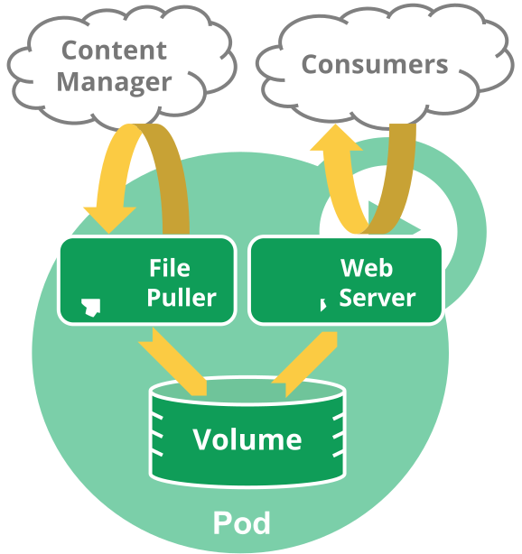

# Workloads

## Pods

### Pod Overview

#### Understanding Pods

A pod is the smallest deployable object in the Kubernetes object model.

Pods can be used in two ways:

* Pods that run a single container
* Pods that run multipole containers

Each pod is meant to run a single instance of a given application.




**Networking**

Each pod is assigned a unique IP address. Every container in a pod shares that network namespace, including IP address and network ports. Containers inside a pod see each other all as localhost.

**Storage**

A pod can specify a set of shared storage volumes, that can also persist data.

#### Working with Pods

**Pods and controllers**

Workload resources that manage one or more pods:
* Deployment
* StatefulSet
* DaemonSet

#### Pod Templates
Controllers for workload resources create pods from a pod template and then manage them on your behalf.

```yaml
apiVersion: batch/v1
kind: Job
metadata:
  name: hello
spec:
  template:
    # This is the pod template
    spec:
      containers:
      - name: hello
        image: busybox
        command: ['sh', '-c', 'echo "Hello, Kubernetes!" && sleep 3600']
      restartPolicy: OnFailure
    # The pod template ends here
```

Modifying a pod template or switching to a new one has no effect on existing pods. Instead, a new pod is created to match the revised (or new) template.

### Pods

#### Motivation for pods

**Management**

**Resource sharing and communication**

#### Uses of pods
Pods can host vertically integrated application stacks (like LAMP), but they primarily support co-located, co-managed helper programs such as:

* content management systems, file and data loaders, local cache managers
* log and checkpoint backup, compression, rotation, snapshotting
* data change watchers, log tailers, logging and monitoring adapters, event publishers
* proxies, bridges and adapters
* controllers, managers, configurators, and updaters

#### Alternatives considered
_Why not just run multiple programs in a single (Docker) container?_

* Transparency
* Decoupling dependencies
* Ease of use
* Efficiency

#### Durability (or not) of pods
Pods not intended to be treated as durable. The do not survive: scheduling, node failures or other evictions.

Users should not create pods directly. They should always use controllers.

Contollers provide self-healing within a cluster scope, as well as replication and rollout management.

#### Termination of Pods
Pod processes should be allowed to gracefully terminate rather than violently killed.

Note flow is different if one of pod's containers has a [preStop hook](https://kubernetes.io/docs/concepts/containers/container-lifecycle-hooks/#hook-details).

By default all deletes (```kubectl delete```) are graceful within 30 seconds. ```kubectl delete``` supports ```--grace-period=<seconds>``` option. To kill immediately, use ```--force``` with ```grace-period=0```.

Force deletions can potentially be dangerous for some pods and should be performed with caution. Refer to doc for [deleting Pods from a StatefulSet](https://kubernetes.io/docs/tasks/run-application/force-delete-stateful-set-pod/).

#### Privileged mode for pod containers
Any container in a pod can enable privileged mode by using the ```privileged``` flag in the [security context](https://kubernetes.io/docs/concepts/containers/container-lifecycle-hooks/#hook-details) of the container spec. This is used where container wants to invoke Linux features like network manipulation or accessing devices.

#### API Object
Pod is a top-level resource in the Kubernetes API

### Pod Lifecycle

#### Pod phase

* Pending
* Running
* Succeeded
* Failed
* Unknown

#### Pod conditions

#### Container Probes

Three additional kinds of probe:
* livenessProbe
* readinessProbe
* startupProbe

#### Container States
* Waiting
* Running
* Terminated
*
#### Pod readiness

**Status for Pod readiness**

Ready only when both:
* All containers ready
* All conditions in ```ReadinessGates``` are ```True```

#### Restart policy
* Always
* On Failure
* Never

Default is Always.

#### Pod lifetime
Pods remain until a human or controller explicitly removes them. Control plane cleans up terminated pods when number exceeds the configured threshold (```terminated-pod-gc-threshold``` in kube-controller-manager).

### Init Containers
Init containers are exactly like regular containers, except:
* Init containers always run to completion
* Each init container must complete successfully before the next one starts

#### Using init containers
* Init containers can contain utilities or custom code for setup not present in the app image
* Run with a different view, for example access to Secrets other app containers cannot
* Block or delay app container startup until preconditions met
* Securely run utilities or custom code that would otherwise make a container less secure

#### Rules for resource usage
* highest resource request or limit on all init containers is effective init request/limit
* Pod’s effective request/limit for a resource is the higher of:
    * the sum of all app containers request/limit for a resource
    * the effective init request/limit for a resource
* Scheduling done based on effective requests/limits
* Both init and app containers share the Pod's effective QoS tier

#### Pod restarts
* User updates pod spec
* Pod infrastructure container is restarted
* All containers in a pod terminated while restartPolicy set to Always

### Pod Preset
In v1.6 [alpha] Pod presets are objects for injecting information into pods at creation time. This info can include secrets, volumes, volume mounts and environment variables.

See [Injecting data into a Pod using PodPreset](https://kubernetes.io/docs/tasks/inject-data-application/podpreset/).

### Pod Topology Spread Constraints
In v1.18 [beta] you can use topology spread constraints to control how Pods are spread across your cluster among failure-domains such as regions, zones, nodes, and other user-defined topology domains. This can help to achieve high availability as well as efficient resource utilization.

#### Cluster-level default constraints
In v1.18 [alpha] it is possible to set default topology spread constraints for a cluster.

#### Comparison with PodAffinity/PodAntiAffinity
In Kubernetes, directives related to “Affinity” control how Pods are scheduled - more packed or more scattered.

### Disruptions
See complete [guide](https://kubernetes.io/docs/concepts/workloads/pods/disruptions/).

#### Voluntary and involuntary Disruptions
Pods do not disappear until someone (a person or a controller) destroys them, or there is an unavoidable hardware or system software error.

#### Dealing with Disruptions
* Ensure your pod requests the resources it needs
* Replicate your application if you need high availability
* For even higher availability, spread apps across racks (using anti-affinity) or zones (if using a multi-zone cluster)

#### How Disruption Budgets work
In v1.5 [beta], an application owner can create a PodDisruptionBudget object (PDB) for each application. A PDB limits the number of pods of a replicated application that are down simultaneously from voluntary disruptions. 

PDBs cannot prevent involuntary disruptions from occurring, but they do count against the budget.

#### Separating Cluster Owner and Application Owner Roles
Often, it is useful to think of the Cluster Manager and Application Owner as separate roles with limited knowledge of each other.

#### How to perform Disruptive Actions on your Cluster
If you are a Cluster Administrator, and you need to perform a disruptive action on all the nodes in your cluster:
* Accept downtime during upgrade
* Failover to another complete replica cluster
* Write disruption tolerant apps and use PDBs

### Ephemeral Containers
In v1.16 [alpha]. Ephemeral containers are a special type of container that runs temporarily in an existing pod to accomplish user-initiated actions like troubleshooting.

## Controllers

### ReplicaSet

A ReplicaSet’s purpose is to maintain a stable set of replica Pods running at any given time.

#### When to use
Deployments (which can create and manage ReplicaSets) are preferred over directly created ReplicaSets because deployments provide declarative updates to pods.

#### Non-Template Pod acquisitions
A ReplicaSet is not limited to owning Pods specified by its template– it can acquire other Pods in the manner specified in the previous sections, so make sure bare Pods do not have labels that match one of your ReplicaSets.

#### Writing a ReplicaSet manifest
As with all other Kubernetes API objects, a ReplicaSet needs the apiVersion, kind, and metadata fields.

#### Working with ReplicaSets
To delete, use ```kubectl delete```. The [Garbage Collector](https://kubernetes.io/docs/concepts/workloads/controllers/garbage-collection/) automatically deletes all dependent pods.

#### Alternatives
* Deployment (Recommended)
* Bare Pods
* Job
* DaemonSet
* ReplicationController

### ReplicationController
A ReplicationController ensures that a specified number of pod replicas are running at any one time. 

#### How it works
If there are too many pods, the ReplicationController terminates the extra pods.

#### Writing a ReplicationController Spec
As with all other Kubernetes config, a ReplicationController needs apiVersion, kind, and metadata fields. It also needs a .spec section.

* Pod Template
* Labels on ReplicationController
* Pod Selector

#### Working with ReplicationControllers
Deleting controllers and pods is accomplished with ```kubectl delete```.

#### Alternatives
* Deployment (Recommended)
* ReplicaSet
* Bare Pods
* Job
* DaemonSet

### Deployments
A Deployment provides _declarative_ updates for Pods and ReplicaSets.

You describe a desired state in a Deployment, and the Deployment Controller changes the actual state to the desired state at a controlled rate.

#### Use Case
* Create a deployment to rollout a ReplicaSet
* Declare the new state of the Pods
* Rollback to an earlier deployment revision
* Scale up the deployment to facilitate more load
* Pause the deployment to apply multiple fixes
* Use the status of the deployment as an indicator that a rollout is stuck
* Clean up older ReplicaSets

#### Creating
controllers/nginx-deployment.yaml

```yaml
apiVersion: apps/v1
kind: Deployment
metadata:
  name: nginx-deployment
  labels:
    app: nginx
spec:
  replicas: 3
  selector:
    matchLabels:
      app: nginx
  template:
    metadata:
      labels:
        app: nginx
    spec:
      containers:
      - name: nginx
        image: nginx:1.14.2
        ports:
        - containerPort: 80
```

Create:

```bash
$ kubectl apply -f https://k8s.io/examples/controllers/nginx-deployment.yaml
```

Check:

```bash
$ kubectl get deployments
NAME               READY   UP-TO-DATE   AVAILABLE   AGE
nginx-deployment   0/3     0            0           1s
```

Status:

```bash
$ kubectl rollout status deployment.v1.apps/nginx-deployment
Waiting for rollout to finish: 2 out of 3 new replicas have been updated...
deployment.apps/nginx-deployment successfully rolled out
```

For ReplicaSet that's part of deploy:

```bash
$ kubectl get rs
NAME                          DESIRED   CURRENT   READY   AGE
nginx-deployment-75675f5897   3         3         3       18s
```

Show the labels:

```bash
$ kubectl get pods --show-labels
NAME                                READY     STATUS    RESTARTS   AGE       LABELS
nginx-deployment-75675f5897-7ci7o   1/1       Running   0          18s       app=nginx,pod-template-hash=3123191453
nginx-deployment-75675f5897-kzszj   1/1       Running   0          18s       app=nginx,pod-template-hash=3123191453
nginx-deployment-75675f5897-qqcnn   1/1       Running   0          18s       app=nginx,pod-template-hash=3123191453
```

The pod-template-hash label is added by the Deployment controller to every ReplicaSet that a Deployment creates or adopts. DO NOT CHANGE IT!

#### Updating
A rollout is triggered when a deployment pod template (.spec.template) is changed.

**Example: Steps update pods from nginx 1.14.2 to 1.16.1 image**

```bash
$ kubectl --record deployment.apps/nginx-deployment \
set image deployment.v1.apps/nginx-deployment \
nginx=nginx:1.16.1
```

or

```bash
$ kubectl set image deployment/nginx-deployment \
nginx=nginx:1.16.1 --record

deployment.apps/nginx-deployment image updated
```

You could also edit the deployment and change .spec.template.spec.containers[0] from nginx:1.14.2 to nginx:1.16.1.

```bash
$ kubectl edit deployment.v1.apps/nginx-deployment

deployment.apps/nginx-deployment edited
```

For status:

```bash
$ kubectl rollout status deployment.v1.apps/nginx-deployment
Waiting for rollout to finish: 2 out of 3 new replicas have been updated...

...
deployment.apps/nginx-deployment successfully rolled out
```

After success, use ```kubectl get deployments```:

```bash
NAME               READY   UP-TO-DATE   AVAILABLE   AGE
nginx-deployment   3/3     3            3           36s
```

#### Rolling Back
By default, all of the Deployment’s rollout history is kept in the system so that you can rollback anytime you want.

**Checking Rollout History**

```bash
$ kubectl rollout history deployment.v1.apps/nginx-deployment
deployments "nginx-deployment"
REVISION    CHANGE-CAUSE
1           kubectl apply --filename=https://k8s.io/examples/controllers/nginx-deployment.yaml --record=true
2           kubectl set image deployment.v1.apps/nginx-deployment nginx=nginx:1.16.1 --record=true
3           kubectl set image deployment.v1.apps/nginx-deployment nginx=nginx:1.161 --record=true
```

Details of revision:

```bash
$ kubectl rollout history deployment.v1.apps/nginx-deployment --revision=2
deployments "nginx-deployment" revision 2
  Labels:       app=nginx
          pod-template-hash=1159050644
  Annotations:  kubernetes.io/change-cause=kubectl set image deployment.v1.apps/nginx-deployment nginx=nginx:1.16.1 --record=true
  Containers:
   nginx:
    Image:      nginx:1.16.1
    Port:       80/TCP
     QoS Tier:
        cpu:      BestEffort
        memory:   BestEffort
    Environment Variables:      <none>
  No volumes.
```

**Rolling Back***

```bash
$ kubectl rollout undo deployment.v1.apps/nginx-deployment
deployment.apps/nginx-deployment rolled back
```
Could also do this with ```--to-revision``` option:

```bash
$ kubectl rollout undo deployment.v1.apps/nginx-deployment --to-revision=2
```

To check on success, run ```get deployment```, then get details (```kubectl describe deployment nginx-deployment```).

#### Scaling

Scale using the following:

```bash
$ kubectl scale deployment.v1.apps/nginx-deployment --replicas=10
deployment.apps/nginx-deployment scaled
```

#### Pausing or Resuming
You can pause a Deployment before triggering one or more updates and then resume it.

```bash
$ kubectl rollout pause deployment.v1.apps/nginx-deployment
```

```bash
$ kubectl rollout resume deployment.v1.apps/nginx-deployment
```

#### Deployment Status
A Deployment enters various states during its lifecycle. It can be progressing while rolling out a new ReplicaSet, it can be complete, or it can fail to progress.

Monitor with ```kubectl rollout status```.

**Complete Deployment**

Kubernetes marks a Deployment as complete when:
* All replicas have been updated to latest verion specified
* All replicas are available
* No old replicas running

Check using ```rollout status```. If completely successful, zero exit code is returned:

```bash
Waiting for rollout to finish: 2 of 3 updated replicas are available...
deployment.apps/nginx-deployment successfully rolled out
$ echo $?
0
```

**Failed Deployment**

Your Deployment may get stuck trying to deploy its newest ReplicaSet without ever completing. Cases:

* insufficient quota
* Readiness probe fails
* Image pull errors
* Insufficient perms
* Limit ranges
* App runtime misconfig

One way you can detect this condition is to specify a deadline parameter in your Deployment spec:

```bash
$ kubectl patch deployment.v1.apps/nginx-deployment \
-p '{"spec":{"progressDeadlineSeconds":600}}'

deployment.apps/nginx-deployment patched
```
Once the deadline has been exceeded, the controller ads a DeploymentCondition to .status.conditions:

* Type=Progressing
* Status=False
* Reason=ProgressDeadlineExceeded

You may experience transient errors, due to a low timeout or some other error.

```bash
<...>
Conditions:
  Type            Status  Reason
  ----            ------  ------
  Available       True    MinimumReplicasAvailable
  Progressing     True    ReplicaSetUpdated
  ReplicaFailure  True    FailedCreate
<...>
```
Once the deadline is exceeded:

```bash
Conditions:
  Type            Status  Reason
  ----            ------  ------
  Available       True    MinimumReplicasAvailable
  Progressing     False   ProgressDeadlineExceeded
  ReplicaFailure  True    FailedCreate
```

If the problem is an insufficient quota, you can scale down other running controllers or increasing the quota. If satisfied:

```bash
Conditions:
  Type          Status  Reason
  ----          ------  ------
  Available     True    MinimumReplicasAvailable
  Progressing   True    NewReplicaSetAvailable
```

Check for progress failure with ```kubectl rollout status```:

```bash
Waiting for rollout to finish: 2 out of 3 new replicas have been updated...
error: deployment "nginx" exceeded its progress deadline
$ echo $?
1
```
All actions that apply to a complete Deployment also apply to a failed Deployment.

### StatefulSets
StatefulSet is the workload API object used to manage stateful applications.

Manages the deployment and scaling of a set of Pods, and provides guarantees about the ordering and uniqueness of these Pods.

#### Using
* Stable, unique network identifiers.
* Stable, persistent storage.
* Ordered, graceful deployment and scaling.
* Ordered, automated rolling updates.

#### Limitations

#### Components

#### Pod Selector
You must set the .spec.selector field of a StatefulSet to match the labels of its .spec.template.metadata.labels

#### Pod Identity
StatefulSet Pods have a unique identity that is comprised of an ordinal, a stable network identity, and stable storage. The identity sticks to the Pod, regardless of which node it’s (re)scheduled on.

#### Deployment and Scaling Guarantees

**Pod Management Policies**

**OrderedReady Pod Management**

**Parallel Pod Management**

#### Update Strategies
In Kubernetes 1.7 and later, StatefulSet’s .spec.updateStrategy field allows you to configure and disable automated rolling updates for containers, labels, resource request/limits, and annotations for the Pods in a StatefulSet.

**Rolling Updates**

**Partitions**

**Forced Rollback**

### DaemonSet
A DaemonSet ensures that all (or some) Nodes run a copy of a Pod. As nodes are added to the cluster, Pods are added to them. As nodes are removed from the cluster, those Pods are garbage collected. Deleting a DaemonSet will clean up the Pods it created.

Typical uses:

* running a cluster storage daemon
* running a logs collection daemon on every node
* running a node monitoring daemon on every node,

### Garbage Collection
The role of the Kubernetes garbage collector is to delete certain objects that once had an owner, but no longer have an owner.

#### Owners and dependents
Some Kubernetes objects are owners of other objects. The owned objects are called dependents of the owner object. 

#### Controlling deletion of dependents

Deletes dependents in background:

```bash
$ kubectl proxy --port=8080
curl -X DELETE localhost:8080/apis/apps/v1/namespaces/default/replicasets/my-repset \
  -d '{"kind":"DeleteOptions","apiVersion":"v1","propagationPolicy":"Background"}' \
  -H "Content-Type: application/json"
```

Deletes in foreground:

```bash
$ kubectl proxy --port=8080
curl -X DELETE localhost:8080/apis/apps/v1/namespaces/default/replicasets/my-repset \
  -d '{"kind":"DeleteOptions","apiVersion":"v1","propagationPolicy":"Foreground"}' \
  -H "Content-Type: application/json"
```

### TTL Controller for Finished Resources
FEATURE STATE: Kubernetes v1.12 [alpha]
The TTL controller provides a TTL (time to live) mechanism to limit the lifetime of resource objects that have finished execution. TTL controller only handles Jobs for now, and may be expanded to handle other resources that will finish execution, such as Pods and custom resources.


### Jobs Run to Completion
A Job creates one or more Pods and ensures that a specified number of them successfully terminate. As pods successfully complete, the Job tracks the successful completions. When a specified number of successful completions is reached, the task (ie, Job) is complete. Deleting a Job will clean up the Pods it created.

```bash
$ kubectl describe jobs/pi
```

#### Handling Pod and Container Failures

### Job Termination and Cleanup

#### Clean Up Finished Jobs Automatically
Finished Jobs are usually no longer needed in the system. Keeping them around in the system will put pressure on the API server. If the Jobs are managed directly by a higher level controller, such as CronJobs, the Jobs can be cleaned up by CronJobs based on the specified capacity-based cleanup policy.

#### Job Patterns

#### Alternatives
* Bare Pods
* Replication Controller
* Single Job starts Controller

#### Cron Jobs
You can use a CronJob to create a Job that will run at specified times/dates.

### CronJob
