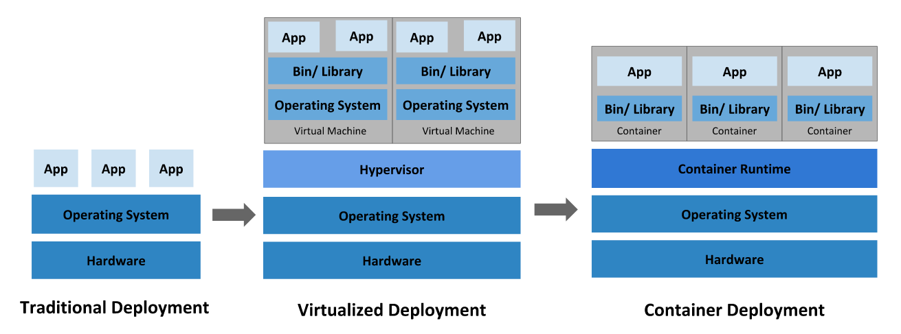
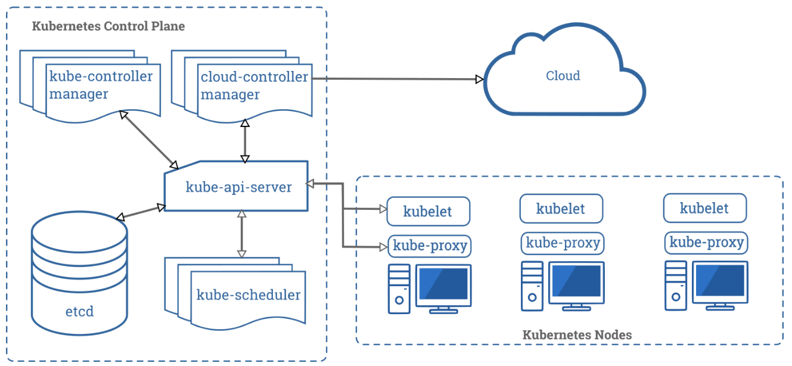

# Overview

## What is Kubernetes?

Kubernetes is a portable, extensible, open-source platform for managing containerized workloads and services, that facilitates both declarative configuration and automation. It has a large, rapidly growing ecosystem. Kubernetes services, support, and tools are widely available.

The name Kubernetes originates from Greek, meaning helmsman or pilot. Google open-sourced the Kubernetes project in 2014. Kubernetes combines over 15 years of Google’s experience running production workloads at scale with best-of-breed ideas and practices from the community.

This diagram shows the evolution of deployments from the traditional bare metal server model, through virtual machines to containers:



Containers are popular because of the following benefits:

* Agile application creation and deployment: increased ease and efficiency of container image creation compared to VM image use.
* Continuous development, integration, and deployment: provides for reliable and frequent container image build and deployment with quick and easy rollbacks (due to image immutability).
* Dev and Ops separation of concerns: create application container images at build/release time rather than deployment time, thereby decoupling applications from infrastructure.
* Observability not only surfaces OS-level information and metrics, but also application health and other signals.
* Environmental consistency across development, testing, and production: Runs the same on a laptop as it does in the cloud.
* Cloud and OS distribution portability: Runs on Ubuntu, RHEL, CoreOS, on-premises, on major public clouds, and anywhere else.
* Application-centric management: Raises the level of abstraction from running an OS on virtual hardware to running an application on an OS using logical resources.
* Loosely coupled, distributed, elastic, liberated micro-services: applications are broken into smaller, independent pieces and can be deployed and managed dynamically – not a monolithic stack running on one big single-purpose machine.
* Resource isolation: predictable application performance.
* Resource utilization: high efficiency and density.

### Why you need Kubernetes and what it can do

Kubernetes provides the following for container deployments:

* Service discovery and load balancing
* Storage orchestration
* Automated rollouts and rollbacks
* Automatic bin packing
* Self-healing
* Secret and configuration management
* Declarative API
* Eliminates the need for orchestration

### What Kubernetes is not
It is not a traditional, monolithic, all-inclusive PaaS (Platform as a Service) system.

* Does not limit the types of applications supported
* Does not deploy source code and does not build your application
* Does not provide application-level services (such as middleware, message buses)
* Does not dictate logging, monitoring or alerting solutions
* Does not provide nor mandate a configuration language/system
* Does not provide or adopt any comprehensive machine configuration, maintenance, management or self-healing system
* Does not provide a mere orchestration system

## Kubernetes Components

When you deploy Kubernetes, you get a cluster.

A cluster consists of a set of workers, called nodes, that run containerized apps.

Worker nodes host pods that are the components of the app workload.

The control plane manages the nodes and pods in the cluster.



### Control Plane
* [kube-apiserver](https://kubernetes.io/docs/concepts/overview/components/#kube-apiserver)
* [etcd](https://kubernetes.io/docs/concepts/overview/components/#etcd)
* [kube-scheduler](https://kubernetes.io/docs/concepts/overview/components/#kube-scheduler)
* [kube-controller-manager](https://kubernetes.io/docs/concepts/overview/components/#kube-controller-manager)
    * Node controller
    * Replication controller
    * Endpoints controller
    * Service Account & Token controller
* [cloud-controller-manager](https://kubernetes.io/docs/concepts/overview/components/#cloud-controller-manager)
    * Node controller
    * Route controller
    * Service controller

Cloud controller runs controllers specific to your cloud provider

### Node Components
* [kubelet](https://kubernetes.io/docs/concepts/overview/components/#kubelet)
* [kube-proxy](https://kubernetes.io/docs/concepts/overview/components/#kube-proxy)
* [Container Runtime](https://kubernetes.io/docs/concepts/overview/components/#container-runtime)

### Addons
* [DNS](https://kubernetes.io/docs/concepts/overview/components/#dns) REQUIRED!
* [Web UI](https://kubernetes.io/docs/concepts/overview/components/#web-ui-dashboard)
* [Container Resource Monitoring](https://kubernetes.io/docs/concepts/overview/components/#container-resource-monitoring)
* [Cluster-level Logging](https://kubernetes.io/docs/concepts/overview/components/#cluster-level-logging)

## The Kubernetes API
[API Conventions](https://git.k8s.io/community/contributors/devel/sig-architecture/api-conventions.md)

[API Reference](https://kubernetes.io/docs/reference)

[Controlling API Access](https://kubernetes.io/docs/reference/access-authn-authz/controlling-access/)

The Kubernetes API serves as the foundation for the declarative configuration schema for the system. The [kubectl](https://kubernetes.io/docs/reference/kubectl/overview/) tool can be used to create, update, delete and get API objects.


### API changes
[API deprecation policy](https://kubernetes.io/docs/reference/using-api/deprecation-policy/)

[API change document](https://git.k8s.io/community/contributors/devel/sig-architecture/api_changes.md)

### OpenAPI and Swagger definitions
[OpenAPI](https://www.openapis.org/)

Starting with Kubernetes 1.10, the Kubernetes API server serves an OpenAPI spec via the /openapi/v2 endpoint. The requested format is specified by setting HTTP headers.

OpenAPI spec:

|Before 1.10                |Starting with Kubernetes 1.10|
|---                        |---                          |
|GET /swagger.json          |GET /openapi/v2 Accept: application/json
|GET /swagger-2.0.0.pb-v1   |GET /openapi/v2 Accept: application/com.github.proto-openapi.spec.v2@v1.0+protobuf|
|GET /swagger-2.0.0.pb-v1.gz|GET /openapi/v2 Accept: application/com.github.proto-openapi.spec.v2@v1.0+protobuf Accept-Encoding: gzip|

### API Versioning

Supports multiple versions like: ```/api/v1```, ```/apis/extensions/v1beta1```.

* Alpha level
* Beta level
* Stable level

### API Groups
* _Core_ group (a/k/a the _legacy_ group), is at REST path ```/api/v1``` and uses ```apiVersion: v1```.
* Named groups use REST paths ```/apis/$GROUP_NAME/$VERSION``` and ```apiVersion: $GROUP_NAME/$VERSION```. For example, ```apiVersion: batch/v1```.

### Enabling or disabling API groups
Certain resources and API groups enabled by default. Enable or disable with ```--runtime-config``` on apiserver. For example: ```--runtime-config=batch/v1=false``` or ```--runtime-config=batch/v2alpha1```. Comma separated sets of key-value pairs are accepted.

### Enabling specific resources in the extensions/v1beta1 group

DaemonSets, Deployments, StatefulSet, NetworkPolicies, PodSecurityPolcies and ReplicaSets in ```extensions/v1beta1``` are disabled by default. To enable:

```--runtime-config=extensions/v1beta1/deployments=true, extensions/v1beta1/daemonsets=true```

## Working with Kubernetes Objects

### Understanding Kubernetes Objects
Kubernetes objects are persistent entities in the Kubernetes system. Kubernetes uses these entities to represent the state of your cluster. Specifically, they can describe:

* What containerized applications are running (and on which nodes)
* The resources available to those applications
* The policies around how those applications behave, such as restart policies, upgrades, and fault-tolerance

A Kubernetes object is a “record of intent”--once you create the object, the Kubernetes system will constantly work to ensure that object exists. By creating an object, you’re effectively telling the Kubernetes system what you want your cluster’s workload to look like; this is your cluster’s desired state.

#### Object Spec and Status

#### Describing a Kubernetes Object

application/deployment.yaml
```yaml
apiVersion: apps/v1 # for versions before 1.9.0 use apps/v1beta2
kind: Deployment
metadata:
  name: nginx-deployment
spec:
  selector:
    matchLabels:
      app: nginx
  replicas: 2 # tells deployment to run 2 pods matching the template
  template:
    metadata:
      labels:
        app: nginx
    spec:
      containers:
      - name: nginx
        image: nginx:1.14.2
        ports:
        - containerPort: 80
```
Deploy the object:

```bash
$ kubectl apply -f https://k8s.io/examples/application/deployment.yaml --record
```
System response:

```bash
deployment.apps/nginx-deployment created
```
Required fields:

* apiVersion (version to use)
* kind (type of object)
* metadata (identification)
* spec (desired state)

### Kubernetes Object Management
#### Management techniques
* Imperative commands
* Imperative object configuration
* Declarative object configuration

#### Imperative commands
```bash
$ kubectl run nginx --image nginx
```
Alternate syntax:
```bash
$ kubectl create deployment nginx --image nginx
```
Commands _do not_:
* integrate with change review processes
* provide an audit trail
* provide a source of records
* a template for creating new objects

#### Imperative object configuration
Create objects defined in a config file:
```bash
$ kubectl create -f nginx.yaml
```
Delete objects defined in two config files:

```bash
$ kubectl delete -f nginx.yaml -f redis.yaml
```
Update objects defined on a config file by overwriting the live config:

```bash
$ kubectl replace -f nginx.yaml
```
Advantages:
* Can be stored in source control.
* Can integrate with processes like change review.
* Provides a template for new objects.
* Simpler and easier to understand than declarative config.
* As of K1.5, is is more mature than declarative config.

Disadvantages:
* Requires a basic understanding of object schema.
* Updates to live objects must be reflected in config files, or will be lost during next replacement.

#### Declarative object configuration
When using declarative object configuration, a user operates on object configuration files stored locally, however the user does not define the operations to be taken on the files. Create, update, and delete operations are automatically detected per-object by kubectl. This enables working on directories, where different operations might be needed for different objects.

Advantages:
* Changes made directly to live objects are retained, even if they are not merged back into the configuration files.
* Declarative object configuration has better support for operating on directories and automatically detecting operation types (create, patch, delete) per-object.

Disadvantages:
* Declarative object configuration is harder to debug and understand results when they are unexpected.
* Partial updates using diffs create complex merge and patch operations.

Can process all object configuration files in the configs directory, and create or patch the live objects (can first diff to see what will be applied):

```bash
$ kubectl diff -f configs/
...
$ kubectl apply -f configs/
```

Recursively process:

```bash
$ kubectl diff -R -f configs/
...
$ kubectl apply -R -f configs/
```

### Object Names and IDs
Each object in your cluster has a Name that is unique for that type of resource. Every Kubernetes object also has a UID that is unique across your whole cluster.

#### Names
* DNS subdomain names
* DNS label names
* Path segment names

#### IDs

### Namespaces
Kubernetes supports multiple virtual clusters backed by the same physical cluster. These virtual clusters are called namespaces.

#### When to use
Namespaces are intended for use in environments with many users spread across multiple teams, or projects.

#### Working with namespaces
```bash
$ kubectl get namespace
NAME          STATUS    AGE
default       Active    1d
kube-system   Active    1d
kube-public   Active    1d
kube-node-lease Active 1d
```
Three initial namespaces: default, kube-system, kube-public

Set the namesapce for a request:

```bash
$ kubectl run nginx --image=nginx --namespace=<namespace>
$ kubectl get pods --namespace=<namespace>
```
Setting a preferred namespace:

```bash
$ kubectl config set-context --current --namespace=<namespace>
...
$ kubectl config view --minify | grep namespace:
```
#### Namespaces and DNS
 If you want to reach across namespaces, you need to use the fully qualified domain name (FQDN) that includes the target namespace.

#### Not all objects are in a namespace
Most resources are in a namespace, but some are not. Also, low level resources like nodes and persistent volumes are not.

```bash
$ kubectl api-resources --namespaced=true
...
$ kubectl api-resources --namespaced=false
```

### Labels and Selectors
#### Labels
Labels are key/value pairs attached to objects, such as pods, that are intended to be meaningful to users.

Labels enable users to map their own organizational structures onto system objects in a loosely coupled fashion, without requiring clients to store these mappings.

Example labels:

```
"release" : "stable"
"release" : "canary"
"environment" : "dev"
"environment" : "qa"
"environment" : "production"
"tier" : "frontend"
"tier" : "backend"
"tier" : "cache"
"partition" : "customerA",
"partition" : "customerB"
"track" : "daily"
"track" : "weekly"
```

#### Label selectors
Unlike names and UIDs, labels do not provide uniqueness. In general, we expect many objects to carry the same label(s).

Via a label selector, the client/user can identify a set of objects. The label selector is the core grouping primitive in Kubernetes.

Equality or inequality requirements allow filtering by label keys:

```yaml
environment = production
tier != frontend
```

Set-based label requirements allow filtering according to a set of values:

```yaml
environment in (production, qa)
tier notin (frontend, backend)
partition
!partition
```

#### API
LIST and WATCH filtering
* equality-based ```?labelSelector=environment%3Dproduction,tier%3Dfrontend```
* set-based ```?labelSelector=environment+in+%28production%2Cqa%29%2Ctier+in+%28frontend%29```

Set references in API objects
* Service and ReplicationController
* Resources that support set-based requirements

ReplicationController label selectors in json or yaml:

```json
"selector": {
    "component": "redis",
},
```

```yaml
selector:
    component: redis
```

Set-based selectors (supported by Job, Deployment, ReplicaSet and DaemonSet):

```yaml
selector:
  matchLabels:
    component: redis
  matchExpressions:
    - {key: tier, operator: In, values: [cache]}
    - {key: environment, operator: NotIn, values: [dev]}
```

### Annotations
You can use Kubernetes annotations to attach arbitrary non-identifying metadata to objects. Clients such as tools and libraries can retrieve this metadata.

```yaml
"metadata": {
  "annotations": {
    "key1" : "value1",
    "key2" : "value2"
  }
}
```
Some examples of use:
* Fields managed by a declarative config layer
* Build, release or image info
* Pointers to logging, monitoring, analytics or audit repos
* Client lib or tool info for debugging purposes
* User or tool/system provenance info
* Rollout tool metadata: config or checkpoints
* Phone or contact numbers for persons responsible
* Directives from the end-user

### Field Selectors
Field selectors let you select Kubernetes resources based on the value of one or more resource fields. Here are some examples of field selector queries:
* metadata.name=my-service
* metadata.namespace!=default
* status.phase=Pending

```bash
$ kubectl get pods --field-selector status.phase=Running
```
Supported field selectors vary by Kubernetes resource type. All resource types support the metadata.name and metad

You can use the =, ==, and != operators with field selectors (= and == mean the same thing).

```bash
$ kubectl get services  --all-namespaces --field-selector metadata.namespace!=default
```

As with label and other selectors, field selectors can be chained together as a comma-separated list. 

```bash
$ kubectl get pods --field-selector=status.phase!=Running,spec.restartPolicy=Always
```
You use field selectors across multiple resource types.

```bash
$ kubectl get statefulsets,services --all-namespaces --field-selector metadata.namespace!=default
```

### Recommended Labels
You can visualize and manage Kubernetes objects with more tools than kubectl and the dashboard. A common set of labels allows tools to work interoperably, describing objects in a common manner that all tools can understand.

#### Labels
In order to take full advantage of using these labels, they should be applied on every resource object.

|Key                        |Description                    |Example                |Type
|-----                      |-----                          |-----                  |-----  |
|app.kubernetes.io/name      |The name of the application	|mysql	                |string |
|app.kubernetes.io/instance	|A unique name identifying the instance of an application|	wordpress-abcxzy|string|
|app.kubernetes.io/component|The component within the architecture|database|string|
|app.kubernetes.io/part-of	|The name of a higher level application this one is part of	|wordpress	|string|
|app.kubernetes.io/managed-by|The tool being used to manage the operation of an application|helm|string|

Example StatefulSet object:

```yaml
apiVersion: apps/v1
kind: StatefulSet
metadata:
  labels:
    app.kubernetes.io/name: mysql
    app.kubernetes.io/instance: wordpress-abcxzy
    app.kubernetes.io/version: "5.7.21"
    app.kubernetes.io/component: database
    app.kubernetes.io/part-of: wordpress
    app.kubernetes.io/managed-by: helm
```

#### Applications and Instances of Applications
An application can be installed one or more times into a Kubernetes cluster and, in some cases, the same namespace. For example, wordpress can be installed more than once where different websites are different installations of wordpress.

#### Examples
Web Application with a database:

Deployment used for WordPress
```yaml
apiVersion: apps/v1
kind: Deployment
metadata:
  labels:
    app.kubernetes.io/name: wordpress
    app.kubernetes.io/instance: wordpress-abcxzy
    app.kubernetes.io/version: "4.9.4"
    app.kubernetes.io/managed-by: helm
    app.kubernetes.io/component: server
    app.kubernetes.io/part-of: wordpress
...
```

Service to expose WordPress
```yaml
apiVersion: v1
kind: Service
metadata:
  labels:
    app.kubernetes.io/name: wordpress
    app.kubernetes.io/instance: wordpress-abcxzy
    app.kubernetes.io/version: "4.9.4"
    app.kubernetes.io/managed-by: helm
    app.kubernetes.io/component: server
    app.kubernetes.io/part-of: wordpress
...
```

MySQL exposed as a StatefulSet
```yaml
apiVersion: apps/v1
kind: StatefulSet
metadata:
  labels:
    app.kubernetes.io/name: mysql
    app.kubernetes.io/instance: mysql-abcxzy
    app.kubernetes.io/version: "5.7.21"
    app.kubernetes.io/managed-by: helm
    app.kubernetes.io/component: database
    app.kubernetes.io/part-of: wordpress
...
```
Service for MySQL as part of WordPress
```yaml
apiVersion: v1
kind: Service
metadata:
  labels:
    app.kubernetes.io/name: mysql
    app.kubernetes.io/instance: mysql-abcxzy
    app.kubernetes.io/version: "5.7.21"
    app.kubernetes.io/managed-by: helm
    app.kubernetes.io/component: database
    app.kubernetes.io/part-of: wordpress
...
```