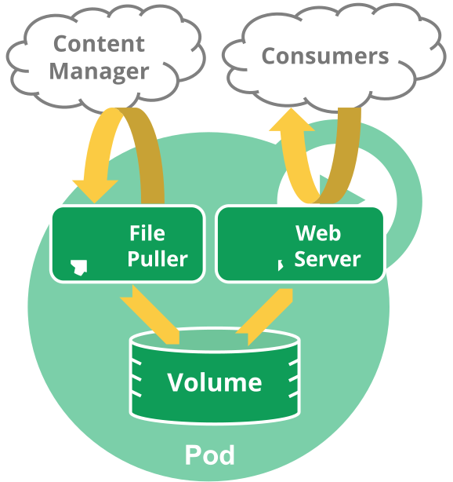

# Workloads

## Pods

### Pod Overview

#### Understanding Pods

A pod is the smallest deployable object in the Kubernetes object model.

A pod encapsulates an application's container (or multiple containers), storage resources, a unique network identity and options governing how the container should run.

Docker is the most common container runtime used in a Kubernetes pod.

Pods can be used in two ways:

* Pods that run a single container
* Pods that run multipole containers

Each pod is meant to run a single instance of a given application.




**Networking**

Each pod is assigned a unique IP address. Every container in a pod shares that network namespace, including IP address and network ports. Containers inside a pod see each other all as localhost.

**Storage**

A pod can specify a set of shared storage volumes, that can also persist data.

#### Working with Pods

**Pods and controllers**

Workload resources that manage one or more pods:
* Deployment
* StatefulSet
* DaemonSet

#### Pod Templates
Controllers for workload resources create pods from a pod template and then manage them on your behalf.

```yaml
apiVersion: batch/v1
kind: Job
metadata:
  name: hello
spec:
  template:
    # This is the pod template
    spec:
      containers:
      - name: hello
        image: busybox
        command: ['sh', '-c', 'echo "Hello, Kubernetes!" && sleep 3600']
      restartPolicy: OnFailure
    # The pod template ends here
```

Modifying a pod template or switching to a new one has no effect on existing pods. Instead, a new pod is created to match the revised (or new) template.

### Pods

#### Motivation for pods

**Management**

**Resource sharing and communication**

#### Uses of pods
Pods can host vertically integrated application stacks (like LAMP), but they primarily support co-located, co-managed helper programs such as:

* content management systems, file and data loaders, local cache managers
* log and checkpoint backup, compression, rotation, snapshotting
* data change watchers, log tailers, logging and monitoring adapters, event publishers
* proxies, bridges and adapters
* controllers, managers, configurators, and updaters

#### Alternatives considered
_Why not just run multiple programs in a single (Docker) container?_

* Transparency
* Decoupling dependencies
* Ease of use
* Efficiency

#### Durability (or not) of pods
Pods not intended to be treated as durable. The do not survive: scheduling, node failures or other evictions.

Users should not create pods directly. They should always use controllers.

Contollers provide self-healing within a cluster scope, as well as replication and rollout management.

A pod is exposed to facilitate:

* scheduler and controller plugability
* support for pod-level ops
* decoupling of pod lifetime from controller lifetime
* decoupling of controllers and services
* clean composition of kublet-level functionality within cluster
* high availability apps

#### Termination of Pods
Pod processes should be allowed to gracefully terminate rather than violently killed.

Note flow is different if one of pod's containers has a [preStop hook](https://kubernetes.io/docs/concepts/containers/container-lifecycle-hooks/#hook-details).

By default all deletes (```kubectl delete```) are graceful within 30 seconds. ```kubectl delete``` supports ```--grace-period=<seconds>``` option. To kill immediately, use ```--force``` with ```grace-period=0```.

Force deletions can potentially be dangerous for some pods and should be performed with caution. Refer to doc for [deleting Pods from a StatefulSet](https://kubernetes.io/docs/tasks/run-application/force-delete-stateful-set-pod/).

#### Privileged mode for pod containers
Any container in a pod can enable privileged mode by using the ```privileged``` flag in the [security context](https://kubernetes.io/docs/concepts/containers/container-lifecycle-hooks/#hook-details) of the container spec. This is used where container wants to invoke Linux features like network manipulation or accessing devices.

#### API Object
Pod is a top-level resource in the Kubernetes API

### Pod Lifecycle

#### Pod phase

* Pending
* Running
* Succeeded
* Failed
* Unknown

#### Pod conditions
* ```lastProbeTime```
* ```lastTransitionTime```
* ```message```
* ```reason```
* ```status```
* ```type``` is a string with one of these possible values:
    * ```podScheduled```
    * ```Ready```
    * ```Initialized```
    * ```ContainersReady```

#### Container Probes
To perform a probe (diagnostic), kubelet calls a Handler:

* ExecAction
* TCPSocketAction
* HTTPGetAction

Probes have one of 3 results:
* Success
* Failure
* Unknown

Three additional kinds of probe:
* livenessProbe
* readinessProbe
* startupProbe

**When to use a liveness probe**

If process in container is about to crash on its own, pod's restartPolicy should handle. But if you want to kill and restart if a probe fails, specify liveness _and_ a restartPolicy of Always or OnFailure.

**When to use a readiness probe**

If you'd like to start sending to a pod only when probe succeeds, use a readiness probe.

Also if you want container to take itself down for maintenance.

Requests will be automatically drained when pod is deleted _without_ a readiness probe, as  on deletion pod puts itself in an unready state.

**When to use a startup probe**

If container usually starts in more than ```initialDeplaySeconds``` + ```failureThreshold``` x ```periodSeconds```, use a startup probe.

#### Pod and Container status

#### Container States
* Waiting
* Running
* Terminated
*
#### Pod readiness

```yaml
kind: Pod
...
spec:
  readinessGates:
    - conditionType: "www.example.com/feature-1"
status:
  conditions:
    - type: Ready                              # a built in PodCondition
      status: "False"
      lastProbeTime: null
      lastTransitionTime: 2018-01-01T00:00:00Z
    - type: "www.example.com/feature-1"        # an extra PodCondition
      status: "False"
      lastProbeTime: null
      lastTransitionTime: 2018-01-01T00:00:00Z
  containerStatuses:
    - containerID: docker://abcd...
      ready: true
...
```
**Status for Pod readiness**

Ready only when both:
* All containers ready
* All conditions in ```ReadinessGates``` are ```True```

When a pod's containers are Ready but one custom condition is missing/False, the kublet will set the pod to ```ContainersReady```.

#### Restart policy
* Always
* On Failure
* Never

Default is Always.

#### Pod lifetime
Pods remain until a human or controller explicitly removes them. Control plane cleans up terminated pods when number exceeds the configured threshold (```terminated-pod-gc-threshold``` in kube-controller-manager).

Pod creation resources:
* Deployment, ReplicaSet or StatefulSet
* Job
* DaemonSet

All workload resources have a PodSpec.

If a node dies or is disconnected, Kubernetes sets the phase of all pods on the lost node to ```Failed```.

#### Examples
```yaml
apiVersion: v1
kind: Pod
metadata:
  labels:
    test: liveness
  name: liveness-http
spec:
  containers:
  - args:
    - /server
    image: k8s.gcr.io/liveness
    livenessProbe:
      httpGet:
        # when "host" is not defined, "PodIP" will be used
        # host: my-host
        # when "scheme" is not defined, "HTTP" scheme will be used. Only "HTTP" and "HTTPS" are allowed
        # scheme: HTTPS
        path: /healthz
        port: 8080
        httpHeaders:
        - name: X-Custom-Header
          value: Awesome
      initialDelaySeconds: 15
      timeoutSeconds: 1
    name: liveness
```
### Init Containers
A pod can have multiple containers running apps, but can have one or more init containers that run before the app containers are started.

Init containers are exactly like regular containers, except:
* Init containers always run to completion
* Each init container must complete successfully before the next one starts

#### Using init containers
* Init containers can contain utilities or custom code for setup not present in the app image
* Run with a different view, for example access to Secrets other app containers cannot
* Block or delay app container startup until preconditions met
* Securely run utilities or custom code that would otherwise make a container less secure

#### Examples
* Wait for a service to be created, using a shell one-liner
* Register pod with a remote server with an API call
* Wait for some time before starting the app container
* Clone a git repo to a volume
* Place values into a config file and run a template to generate a config file

Here a simple pod is defined that has two init containers: (1) waits for myservice, (2) waits for mydb. Once both init containers are up, the pod runs the app container.

```yaml
apiVersion: v1
kind: Pod
metadata:
  name: myapp-pod
  labels:
    app: myapp
spec:
  containers:
  - name: myapp-container
    image: busybox:1.28
    command: ['sh', '-c', 'echo The app is running! && sleep 3600']
  initContainers:
  - name: init-myservice
    image: busybox:1.28
    command: ['sh', '-c', "until nslookup myservice.$(cat /var/run/secrets/kubernetes.io/serviceaccount/namespace).svc.cluster.local; do echo waiting for myservice; sleep 2; done"]
  - name: init-mydb
    image: busybox:1.28
    command: ['sh', '-c', "until nslookup mydb.$(cat /var/run/secrets/kubernetes.io/serviceaccount/namespace).svc.cluster.local; do echo waiting for mydb; sleep 2; done"]
```

To run

```
kubectl apply -f myapp.yaml
```

Check status

```
kubectl get -f myapp.yaml
```

For details

```
kubectl describe -f myapp.yaml
```

Logs

```
kubectl logs myapp-pod -c init-myservice
kubectl logs myapp-pod -c init-mydb
```

Config to make services the init containers are waiting to discover:

```yaml
---
apiVersion: v1
kind: Service
metadata:
  name: myservice
spec:
  ports:
  - protocol: TCP
    port: 80
    targetPort: 9376
---
apiVersion: v1
kind: Service
metadata:
  name: mydb
spec:
  ports:
  - protocol: TCP
    port: 80
    targetPort: 9377
```

To create services

```
kubectl apply -f services.yaml
```

Then confirm init containers complete

```
kubectl get -f myapp.yaml
```

#### Rules for resource usage
* highest resource request or limit on all init containers is effective init request/limit
* Pod’s effective request/limit for a resource is the higher of:
    * the sum of all app containers request/limit for a resource
    * the effective init request/limit for a resource
* Scheduling done based on effective requests/limits
* Both init and app containers share the Pod's effective QoS tier

#### Pod restarts
* User updates pod spec
* Pod infrastructure container is restarted
* All containers in a pod terminated while restartPolicy set to Always

### Pod Preset
In v1.6 [alpha] Pod presets are objects for injecting information into pods at creation time. This info can include secrets, volumes, volume mounts and environment variables.

See [Injecting data into a Pod using PodPreset](https://kubernetes.io/docs/tasks/inject-data-application/podpreset/).

### Pod Topology Spread Constraints
In v1.18 [beta] you can use topology spread constraints to control how Pods are spread across your cluster among failure-domains such as regions, zones, nodes, and other user-defined topology domains. This can help to achieve high availability as well as efficient resource utilization.

For an incoming pod to be evenly spread within existing pods across zones:

```yaml
kind: Pod
apiVersion: v1
metadata:
  name: mypod
  labels:
    foo: bar
spec:
  topologySpreadConstraints:
  - maxSkew: 1
    topologyKey: zone
    whenUnsatisfiable: DoNotSchedule
    labelSelector:
      matchLabels:
        foo: bar
  containers:
  - name: pause
    image: k8s.gcr.io/pause:3.1
```

To spread on both zone and node:

```yaml
kind: Pod
apiVersion: v1
metadata:
  name: mypod
  labels:
    foo: bar
spec:
  topologySpreadConstraints:
  - maxSkew: 1
    topologyKey: zone
    whenUnsatisfiable: DoNotSchedule
    labelSelector:
      matchLabels:
        foo: bar
  - maxSkew: 1
    topologyKey: node
    whenUnsatisfiable: DoNotSchedule
    labelSelector:
      matchLabels:
        foo: bar
  containers:
  - name: pause
    image: k8s.gcr.io/pause:3.1
```

#### Cluster-level default constraints
In v1.18 [alpha] it is possible to set default topology spread constraints for a cluster.

```yaml
apiVersion: kubescheduler.config.k8s.io/v1alpha2
kind: KubeSchedulerConfiguration

profiles:
  pluginConfig:
    - name: PodTopologySpread
      args:
        defaultConstraints:
          - maxSkew: 1
            topologyKey: failure-domain.beta.kubernetes.io/zone
            whenUnsatisfiable: ScheduleAnyway
```

#### Comparison with PodAffinity/PodAntiAffinity
In Kubernetes, directives related to “Affinity” control how Pods are scheduled - more packed or more scattered.

### Disruptions
See complette [guide](https://kubernetes.io/docs/concepts/workloads/pods/disruptions/).

#### Voluntary and involuntary Disruptions
Pods do not disappear until someone (a person or a controller) destroys them, or there is an unavoidable hardware or system software error.

We call these unavoidable cases _involuntary disruptions_ to an application.

We call other cases _voluntary disruptions_. These include both actions initiated by the application owner and those initiated by a Cluster Administrator. 

#### Dealing with Disruptions
* Ensure your pod requests the resources it needs
* Replicate your application if you need high availability
* For even higher availability, spread apps across racks (using anti-affinity) or zones (if using a multi-zone cluster)

#### How Disruption Budgets work
In v1.5 [beta], an application owner can create a PodDisruptionBudget object (PDB) for each application. A PDB limits the number of pods of a replicated application that are down simultaneously from voluntary disruptions. 

PDBs cannot prevent involuntary disruptions from occurring, but they do count against the budget.

#### Separating Cluster Owner and Application Owner Roles
Often, it is useful to think of the Cluster Manager and Application Owner as separate roles with limited knowledge of each other. This separation of responsibilities may make sense in these scenarios:
* when there are many application teams sharing a Kubernetes cluster, and there is natural specialization of roles
* when third-party tools or services are used to automate cluster management

#### How to perform Disruptive Actions on your Cluster
If you are a Cluster Administrator, and you need to perform a disruptive action on all the nodes in your cluster:
* Accept downtime during upgrade
* Failover to another complete replica cluster
* Write disruption tolerant apps and use PDBs

### Ephemeral Containers
In v1.16 [alpha]. Ephemeral containers are a special type of container that runs temporarily in an existing pod to accomplish user-initiated actions like troubleshooting.

Need to describe the container in an EphemeralContainers list:

```yaml
{
    "apiVersion": "v1",
    "kind": "EphemeralContainers",
    "metadata": {
            "name": "example-pod"
    },
    "ephemeralContainers": [{
        "command": [
            "sh"
        ],
        "image": "busybox",
        "imagePullPolicy": "IfNotPresent",
        "name": "debugger",
        "stdin": true,
        "tty": true,
        "terminationMessagePolicy": "File"
    }]
}
```
To update containers in the already running pod:

```
kubectl replace --raw /api/v1/namespaces/default/pods/example-pod/ephemeralcontainers -f ec.json
```
Response:

```yaml
{
   "kind":"EphemeralContainers",
   "apiVersion":"v1",
   "metadata":{
      "name":"example-pod",
      "namespace":"default",
      "selfLink":"/api/v1/namespaces/default/pods/example-pod/ephemeralcontainers",
      "uid":"a14a6d9b-62f2-4119-9d8e-e2ed6bc3a47c",
      "resourceVersion":"15886",
      "creationTimestamp":"2019-08-29T06:41:42Z"
   },
   "ephemeralContainers":[
      {
         "name":"debugger",
         "image":"busybox",
         "command":[
            "sh"
         ],
         "resources":{

         },
         "terminationMessagePolicy":"File",
         "imagePullPolicy":"IfNotPresent",
         "stdin":true,
         "tty":true
      }
   ]
}
```
View new container with

```
kubectl describe pod example-pod
```

```
...
Ephemeral Containers:
  debugger:
    Container ID:  docker://cf81908f149e7e9213d3c3644eda55c72efaff67652a2685c1146f0ce151e80f
    Image:         busybox
    Image ID:      docker-pullable://busybox@sha256:9f1003c480699be56815db0f8146ad2e22efea85129b5b5983d0e0fb52d9ab70
    Port:          <none>
    Host Port:     <none>
    Command:
      sh
    State:          Running
      Started:      Thu, 29 Aug 2019 06:42:21 +0000
    Ready:          False
    Restart Count:  0
    Environment:    <none>
    Mounts:         <none>
...
```


## Controllers

### ReplicaSet

### ReplicationController

### Deployments

### StatefulSets

### DaemonSet

### Garbage Collection

### TTL Controller for Finished Resources

### Jobs Run to Configure

### CronJob


